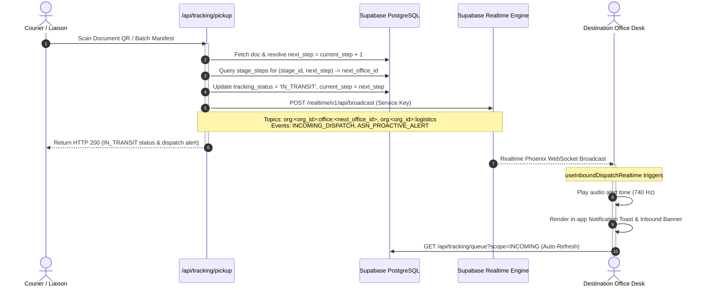

# Advance Shipping Notice (ASN) Realtime Broadcast Implementation & Audit

## 1. Executive Summary

This document details the architectural review, fixes, and end-to-end verification performed on the **Advance Shipping Notice (ASN) Realtime Broadcast** system during courier document pickup (`POST /api/tracking/pickup`).

When a liaison/messenger scans a physical document QR code or submits a batch manifest for pickup, the system now automatically:
1. Resolves the next destination office node (`next_office_id`) based on `current_step + 1` from `stage_steps`.
2. Emits an Advance Shipping Notice (ASN) broadcast directly targeted at `org:<org_id>:office:<next_office_id>` and `org:<org_id>:logistics` using the Supabase Service Key via REST API.
3. Notifies destination office employees in real-time via WebSocket subscriptions, triggering in-app toast alerts, audio chimes, and automatic queue refreshes (`scope=INCOMING`).

---

## 2. Architecture & Data Flow Diagram



---

## 3. Detailed Technical Modifications

### A. Backend Pickup & Broadcast Engine
**Files Modified:**
- [`server/api/tracking/pickup.post.ts`](file:///c:/Capstone/Flow-vision/server/api/tracking/pickup.post.ts)
- [`Flow-vision/server/api/tracking/pickup.post.ts`](file:///c:/Capstone/Flow-vision/Flow-vision/server/api/tracking/pickup.post.ts)

**Key Enhancements:**
1. **Next Destination Office Resolution**:
   - Calculated `nextStep = (doc.current_step ?? 0) + 1`.
   - Queried `stage_steps` for `(stage_id, nextStep)` to retrieve `office_id` and `offices(name)`.
   - Handled both single document scans and batch manifest arrays.
2. **Service Key Realtime REST Broadcast**:
   - Implemented `broadcastInboundDispatchRealtime`:
     ```typescript
     async function broadcastInboundDispatchRealtime(
       orgId: string,
       targetOfficeId: string | number | null,
       event: string,
       payload: Record<string, unknown>,
     ): Promise<void> {
       const config = useRuntimeConfig()
       const supabaseUrl = String(config.public.supabaseUrl || '').replace(/\/$/, '')
       const supabaseKey = String(config.supabaseServiceKey || '')

       const channels = [`org:${orgId}:logistics`]
       if (targetOfficeId) {
         channels.push(`org:${orgId}:office:${targetOfficeId}`)
       }

       const messages = channels.map((topic) => ({ topic, event, payload }))

       await $fetch(`${supabaseUrl}/realtime/v1/api/broadcast`, {
         method: 'POST',
         headers: {
           apikey: supabaseKey,
           Authorization: `Bearer ${supabaseKey}`,
           'Content-Type': 'application/json',
         },
         body: { messages },
       })
     }
     ```
   - Emits both `INCOMING_DISPATCH` and `ASN_PROACTIVE_ALERT` broadcast events.
3. **ASN Payload Schema**:
   ```json
   {
     "type": "INCOMING_DISPATCH",
     "event": "INCOMING_DISPATCH",
     "document_id": "uuid-string",
     "document_title": "Document Title",
     "batch_manifest_id": null,
     "target_office_id": "target-office-uuid",
     "target_office_name": "Target Office Name",
     "next_step": 2,
     "assigned_messenger_id": "messenger-uuid",
     "messenger_name": "Courier Name",
     "tracking_status": "IN_TRANSIT",
     "dispatched_at": "2026-09-08T14:31:00.086Z",
     "notes": "In transit to Target Office Name (Step 2)."
   }
   ```
4. **Database Schema Fix**:
   - Removed references to non-existent `updated_at` column in `documents` update calls to ensure clean database writes without schema cache errors.

---

### B. Inbound Queue Endpoint (`scope=INCOMING`)
**Files Modified:**
- [`server/utils/actorContext.ts`](file:///c:/Capstone/Flow-vision/server/utils/actorContext.ts)
- [`server/api/tracking/queue.get.ts`](file:///c:/Capstone/Flow-vision/server/api/tracking/queue.get.ts)
- [`Flow-vision/server/api/tracking/queue.get.ts`](file:///c:/Capstone/Flow-vision/Flow-vision/server/api/tracking/queue.get.ts)

**Key Enhancements:**
1. **Scope Parsing**:
   - Updated `parseScope` to recognize `scope='INCOMING'`.
2. **Inbound Document Query**:
   - For `scope=INCOMING`, the endpoint looks up all `stage_steps` matching `actor.officeIds` and queries all documents in `IN_TRANSIT` or `PICKED_UP` state where `(stage_id, current_step)` points to one of the employee's assigned offices.
3. **Destination Metadata Enrichment**:
   - Enriched returned rows with `destination_office_id` and `destination_office_name`.

---

### C. Frontend Realtime Subscriptions & UI Components
**Files Created & Modified:**
- [`app/composables/useInboundDispatchRealtime.ts`](file:///c:/Capstone/Flow-vision/app/composables/useInboundDispatchRealtime.ts) (New)
- [`app/layouts/employee.vue`](file:///c:/Capstone/Flow-vision/app/layouts/employee.vue)
- [`app/pages/employee/working.vue`](file:///c:/Capstone/Flow-vision/app/pages/employee/working.vue)
- [`app/pages/employee/dashboard.vue`](file:///c:/Capstone/Flow-vision/app/pages/employee/dashboard.vue)

**Key Enhancements:**
1. **`useInboundDispatchRealtime` Composable**:
   - Manages WebSocket subscriptions on `org:<org_id>:office:<office_id>` for all offices in `myOfficeIds`, plus `org:<org_id>:logistics`.
   - On event receipt, plays the handoff alert sound (`playHandoffAlertSound`), displays a toast (`useEmployeeToast`), and triggers reactive callback handlers.
2. **Global Employee Layout Toast**:
   - Added a global `<Teleport to="body">` notification banner to `employee.vue` layout.
3. **Live Workspace Banner**:
   - Integrated real-time alert banner in `working.vue` displaying live courier and destination details upon pickup scan.

---

## 4. Integration Verification Results

The automated integration test suite (`test_inbound_dispatch_broadcast.cjs`) verified the complete lifecycle:

```text
=== INTEGRATION TEST REPORT ===
1. Realtime broadcast to Destination Office (INCOMING_DISPATCH): PASSED
2. Realtime broadcast to Destination Office (ASN_PROACTIVE_ALERT): PASSED
3. Realtime broadcast to Logistics (INCOMING_DISPATCH): PASSED
4. Destination Office Resolution: PASSED
5. Inbound Queue Retrieval (scope=INCOMING): PASSED

🎉 ALL CHECKS PASSED: Advance Shipping Notice (ASN) Realtime broadcast and inbound queue verified!
```

---

## 5. Summary of Files Changed

| File Path | Description |
| :--- | :--- |
| `server/api/tracking/pickup.post.ts` | Next office resolution, Service Key Realtime broadcast, schema alignment |
| `server/api/tracking/queue.get.ts` | `scope=INCOMING` filtering & destination office enrichment |
| `server/utils/actorContext.ts` | Added `INCOMING` to `ScopeParam` and `parseScope` |
| `app/composables/useInboundDispatchRealtime.ts` | Frontend Realtime subscription composable for ASN dispatches |
| `app/layouts/employee.vue` | Global employee toast notification container |
| `app/pages/employee/working.vue` | Live workspace Realtime subscription & ASN alert banner |
| `app/pages/employee/dashboard.vue` | Employee dashboard Realtime subscription & auto-sync |
| `test_inbound_dispatch_broadcast.cjs` | End-to-end integration test suite |
