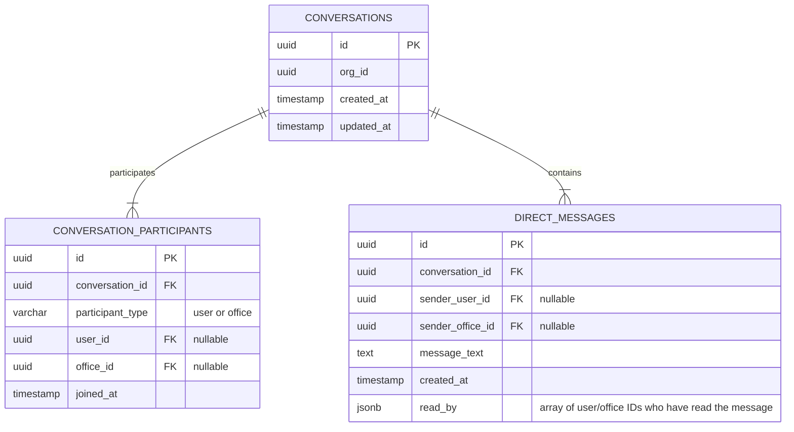
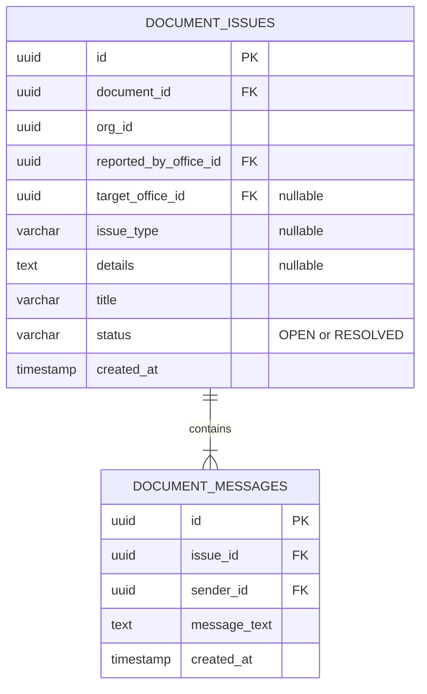

# 💬 Flow-vision Chat & Messaging Systems

Flow-vision implements **three distinct chat/messaging architectures** designed for different communication scopes, protocols, and security requirements:

1. **Private Messaging (Direct Messages / DMs)**: Supabase-backed, real-time messaging between clients and offices/desk agents.
2. **Document Issue & Compliance Chat (Ticket Messages)**: Supabase-backed, real-time messaging inside ticket rooms on documents flagged with discrepancies or pipeline checkpoint issues.
3. **Document-Linked Chat (Discussion Threads - MySQL Legacy)**: MySQL-backed, org-isolated discussions tied directly to trackable documents (maintained for archival/compatibility).

---

## 🏗️ 1. Private Messaging System (DMs)
The Private Messaging system allows **Clients** and **Employees** (acting as office/desk representatives) to communicate directly.

### 📁 Relevant Files
- Database Migration: [01_private_messages_migration.sql](file:///c:/Capstone/Flow-vision/01_private_messages_migration.sql)
- Pinia Store: [chat.ts](file:///c:/Capstone/Flow-vision/app/stores/chat.ts)
- Client UI Page: [messages.vue](file:///c:/Capstone/Flow-vision/app/pages/client/messages.vue)
- Employee UI Page: [messages.vue](file:///c:/Capstone/Flow-vision/app/pages/employee/messages.vue)
- API - Fetch Conversations: [conversations.get.ts](file:///c:/Capstone/Flow-vision/server/api/messages/conversations.get.ts)
- API - Fetch History: [history.get.ts](file:///c:/Capstone/Flow-vision/server/api/messages/history.get.ts)
- API - Send Message: [send.post.ts](file:///c:/Capstone/Flow-vision/server/api/messages/send.post.ts)
- API - Mark Read: [read.post.ts](file:///c:/Capstone/Flow-vision/server/api/messages/read.post.ts)

### 📊 Database Schema (Supabase)
Built on three key relational tables in the public schema:



### 🛰️ API Endpoints

#### `GET /api/messages/conversations`
- **Description**: Returns all conversations the requesting actor participates in.
- **Actor Resolution**:
  - **Clients**: Matched via `actor.userId`.
  - **Employees**: Matched via their assigned `actor.officeIds`.
- **Payload Mapping**: Resolves names for other participants by cross-referencing either the `users` or `offices` tables to display proper titles (e.g. office names or sender names) in the inbox list.
- **Unread Count Calculations**: Computes `unread_count` (integer) and `has_unread` (boolean) in-memory by analyzing the `read_by` JSONB array of direct messages to check if the current user's participant ID is missing from received messages.

#### `GET /api/messages/history?id=<conversation_id>`
- **Description**: Fetches the chronological history of a conversation.
- **Security Check**: Enforces that the current user (either via `userId` or `officeIds`) is a participant in the conversation; otherwise returns `403 Forbidden`.

#### `POST /api/messages/send`
- **Description**: Sends a message to a conversation.
- **Request Body**:
  ```json
  {
    "conversationId": "uuid-optional",
    "text": "Your message text here",
    "targetUserId": "uuid-optional-if-new",
    "targetOfficeId": "uuid-optional-if-new"
  }
  ```
- **Self-Healing Loop**: If no `conversationId` is supplied, it automatically checks if a conversation already exists between the sender and the target. If not, it creates a new `conversations` record, inserts the participants, and routes the message.

#### `POST /api/messages/read`
- **Description**: Marks all messages in a conversation as read.
- **Request Body**:
  ```json
  {
    "conversationId": "uuid"
  }
  ```
- **Execution**: Appends the reader's active participant ID (`user_id` or `office_id`) to the `read_by` JSONB array for all received messages in the target conversation.

### 🔄 Real-Time Mechanism & Timezone Alignment
Real-time messaging is powered by **Supabase PostgreSQL Replication**:
- The Pinia store `useChatStore` initiates a subscription:
  ```typescript
  client.channel('public:direct_messages')
    .on('postgres_changes', { event: 'INSERT', schema: 'public', table: 'direct_messages' }, payload => {
      this.receiveMessage(payload.new as DirectMessage)
    })
    .subscribe()
  ```
- **Time-ago and Clock Formatting (UTC+8 / PST)**: Supabase UTC timestamps lacking zone suffixes are normalized on the client using the exported `parseUtcDate()` helper, which appends `Z` to force standard ISO UTC parsing. Relative formatting (e.g., `"Just now"`, `"5m ago"`) and message bubble clock times are formatted using the resolved local timezone.
- **Instant Preview & Sorting**: The Pinia store reactively sorts and floats active conversations to the top when messages are sent or received. By re-assigning the array reference during sorting (`this.conversations = [...this.conversations].sort(...)`), Vue 3 computed properties (like `mergedList` and `filteredInbox` on messages pages) trigger immediately, forcing the inbox sidebar list layout to update instantly without manual page refreshes.
- **Visual Indicators**: Conversations with `unread_count > 0` are styled with bold titles, bold preview snippets, and a red dot next to timestamps. Sidebar navigation links feature a red numeric notification badge (displaying total unread count) or a red minimized dot. Clicking on a conversation thread triggers the backend read-status reset action, clearing local and global badge indicators.

---

## 🏗️ 2. Document Issue & Compliance Chat System
The Document Issue / Compliance Chat system facilitates discussions between offices and organization admins/clients regarding specific document discrepancies (e.g. missing signatures, incomplete forms, damaged copies) or pipeline checkpoint checks.

### 📁 Relevant Files
- Shared Helpers: [documentIssues.ts](file:///c:/Capstone/Flow-vision/server/utils/documentIssues.ts)
- Composable: [useIssueChatRealtime.ts](file:///c:/Capstone/Flow-vision/app/composables/useIssueChatRealtime.ts)
- Issue Chat Component: [DocumentIssueChatPanel.vue](file:///c:/Capstone/Flow-vision/app/components/employee/documents/DocumentIssueChatPanel.vue)
- Pipeline Chat Component: [DocumentPipelineOfficeChat.vue](file:///c:/Capstone/Flow-vision/app/components/documents/DocumentPipelineOfficeChat.vue)
- API - Fetch Messages: [messages.get.ts](file:///c:/Capstone/Flow-vision/server/api/documents/issues/messages.get.ts)
- API - Send Message: [messages.post.ts](file:///c:/Capstone/Flow-vision/server/api/documents/issues/messages.post.ts)
- API - Create Issue: [create.post.ts](file:///c:/Capstone/Flow-vision/server/api/documents/issues/create.post.ts)

### 📊 Database Schema (Supabase)
Built on two key relational tables in the public schema:



### 🛰️ API Endpoints

#### `GET /api/documents/issues/messages?issue_id=<issue_id>`
- **Description**: Returns chronological chat messages inside an issue thread.
- **Security Check**: Resolves actor and issue; throws `403 Forbidden` if the actor's `org_id` does not match the issue's `org_id` (enforced via [assertIssueOrgAccess](file:///c:/Capstone/Flow-vision/server/utils/documentIssues.ts#L83)).
- **Response**: Returns message data enriched with sender names and roles.

#### `POST /api/documents/issues/messages`
- **Description**: Posts a message into an active issue thread room.
- **Request Body**:
  ```json
  {
    "issue_id": "uuid",
    "message_text": "Your message text here"
  }
  ```
- **Execution Flow**:
  1. Validates org access.
  2. Blocks messaging if the issue is in `RESOLVED` status.
  3. Inserts the message into `document_messages`.
  4. Triggers an email/push compliance message notification using `broadcastComplianceMessageNotification`.
  5. Broadcasts the message in real-time to all connected users in that org's issue channel.

### 🔄 Real-Time Mechanism
Real-time syncing is powered by **Supabase Broadcast Channels**:
- Instead of relying on full PostgreSQL database replication, the server explicitly broadcasts low-latency updates via:
  ```typescript
  // Channel name: `org:{orgId}:issue:{issueId}`
  const channelName = issueRealtimeChannel(orgId, issueId)
  ```
- The frontend subscribes via the `useIssueChatRealtime` composable:
  ```typescript
  const channel = supabase.channel(`org:${orgId}:issue:${issueId}`)
  channel
    .on('broadcast', { event: 'new_message' }, ({ payload }) => {
      onEvent('new_message', payload)
    })
    .on('broadcast', { event: 'issue_resolved' }, ({ payload }) => {
      onEvent('issue_resolved', payload)
    })
    .subscribe()
  ```

---

## 🏗️ 3. Document-Linked Chat System (MySQL Legacy)
The original document discussion system is MySQL-backed and isolated per organization. It remains in the project's codebase as a reference schema and for database archival compatibility.

### 📁 Relevant Files
- Database schema: `chats` MySQL table
- Types: [chat.ts](file:///c:/Capstone/Flow-vision/server/utils/types/chat.ts)
- Storage Helper: [chatStorage.ts](file:///c:/Capstone/Flow-vision/server/utils/chatStorage.ts)
- API - Fetch History: [\[org_id\].get.ts](file:///c:/Capstone/Flow-vision/server/api/chats/%5Borg_id%5D.get.ts)

### 📊 Database Schema (MySQL)
Mapping directly to the `chats` table schema:

| Column | Type | Description |
| :--- | :--- | :--- |
| `message_id` | `INT` | Primary Key, Auto-Incrementing |
| `document_id` | `INT` | Foreign Key → `documents` table |
| `sender_id` | `VARCHAR` | Foreign Key → `users` table |
| `receiver_id` | `VARCHAR` | Foreign Key → `users` table (nullable) |
| `org_id` | `VARCHAR` | Foreign Key → `organizations`/`offices` |
| `message_text`| `TEXT` | Actual message content |
| `created_at` | `TIMESTAMP` | Auto-generated timestamp |

### 🛰️ API Endpoints

#### `GET /api/chats/:org_id?document_id=<document_id>`
- **Description**: Returns chronological chat logs for a document discussion.
- **Security Check**: Enforces a strict `org_id ↔ office_id` parity check. If the requesting `org_id` does not match the document's owning `office_id`, a `403 Forbidden` response is returned.

---

## 📊 Summary Comparison

| Metric | System 1: Private Messaging (DMs) | System 2: Document Issue Chat | System 3: Document-Linked Chat (MySQL) |
| :--- | :--- | :--- | :--- |
| **Scope** | Client-to-Office / User-to-Office | In-context Discrepancy & Compliance | Document discussion thread logs (Archival) |
| **Database** | Supabase (PostgreSQL) | Supabase (PostgreSQL) | MySQL |
| **Real-time Protocol** | Supabase PostgreSQL Replication Channel | Supabase Broadcast Channel (Explicit event) | Client-side polling / Socket (Legacy) |
| **Identifiers** | UUIDs (`conversation_id`, `user_id`) | UUIDs (`issue_id`, `document_id`, `sender_id`) | Integers (`message_id`, `document_id`, `org_id`) |
| **Tenancy Boundary** | Participant validation (`conversation_participants`) | Strict `org_id` matching on issue record | Strict document `office_id` ↔ `org_id` check |
| **UI Entry Point** | Left Sidebar Inbox (`/messages`) | Issue Drawer / Right Panel on Document View | Legacy reference / Archival logging |
