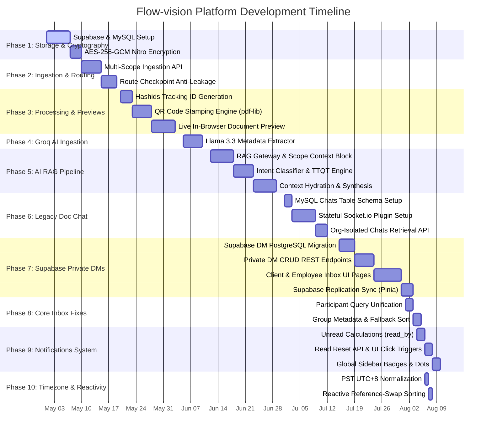

# 📅 Flow-vision System - Gantt Chart Activities & Timeline

This document provides a comprehensive chronological timeline of all development activities across the entire **Flow-vision** platform—ranging from core dual-database architectures, ingestion guards, and Groq AI RAG pipelines, to legacy MySQL chat frameworks and our latest real-time messaging updates.

---

## 📊 Gantt Chart Visualization (Mermaid)

---

## 📝 Complete Chronological Activities Table

| Task ID | Activity / Feature | Component / Description | Dependencies | Estimated Duration |
| :--- | :--- | :--- | :--- | :--- |
| **Phase 1** | **Storage & Cryptography** | | | |
| `1.1` | Supabase & MySQL Setup | Partition schemas: Supabase PostgreSQL for relational tables/auth; MySQL for heavy encrypted file binary storage. | None | 6 Days |
| `1.2` | AES-256-GCM Encryption | Program Nitro encryption plugin to automatically encrypt blobs on insert and decrypt on read. | `1.1` | 3 Days |
| **Phase 2** | **Ingestion & Anti-Leakage** | | | |
| `2.1` | Multi-Scope Ingestion API | Develop `/api/documents/upload.post.ts` validating Client Admin vs. Sub-Office Employee scope assignments. | `1.2` | 5 Days |
| `2.2` | Route Checkpoint Anti-Leakage | Program server-side cross-tenant pointer checks on stages templates to prevent metadata leakage. | `2.1` | 4 Days |
| **Phase 3** | **Document Processing & Visuals** | | | |
| `3.1` | Hashids Tracking ID Generation | Set up Hashids engine to yield unique, secure tracking URIs (`flowvision://track/document_uuid`). | `2.2` | 3 Days |
| `3.2` | QR Code Stamping Engine | Integrate `pdf-lib` to overlay tracking QR codes on every page of PDFs and Word documents. | `3.1` | 5 Days |
| `3.3` | Live In-Browser Previews | Build frontend render panels using `docx-preview` and `mammoth` for live previewing. | `3.2` | 6 Days |
| **Phase 4** | **Groq AI Ingestion Analyzer** | | | |
| `4.1` | Llama 3.3 Ingestion Analyzer | Build lazy-loaded `aiAnalyzer.ts` triggering `llama-3.3-70b-versatile` to extract doc titles and summaries. | `3.3` | 5 Days |
| **Phase 5** | **Multi-Stage AI RAG Pipeline** | | | |
| `5.1` | RAG Gateway & Scope Blocks | Implement `/api/rag/query.ts` to inject scope rules (Global, Office-Local, Personal) based on role profiles. | `4.1` | 6 Days |
| `5.2` | Intent Classifier & TTQT | Integrate intent router and Text-to-Query translator to parse prompts into target filters and keyword arrays. | `5.1` | 5 Days |
| `5.3` | Context Hydration & Synthesis | Write workers to parse text from MySQL binary blobs on-the-fly, feed Groq context, and synthesize HTML Word/Excel templates. | `5.2` | 6 Days |
| **Phase 6** | **Document Chat (MySQL)** | | | |
| `6.1` | MySQL Chats Table Schema Setup | Design original MySQL table `chats` with document and sender relations. | `1.1` | 2 Days |
| `6.2` | Stateful Socket.io Plugin Setup | Program `socket.ts` server plugin with tenancy checks, memory registry, and async MySQL storage workers. | `6.1` | 6 Days |
| `6.3` | Org-Isolated Chats Retrieval API | Develop GET `/api/chats/:org_id` verifying office ownership to prevent cross-tenant exposure. | `6.2` | 3 Days |
| **Phase 7** | **Supabase Private DMs** | | | |
| `7.1` | Supabase DM PostgreSQL Migration | Migrated DM database models (`conversations`, `participants`, `direct_messages`) to Supabase PostgreSQL. | None | 4 Days |
| `7.2` | Private DM REST API Endpoints | Coded conversation fetchers, history queries, and send message endpoints with self-healing creation routing. | `7.1` | 5 Days |
| `7.3` | Client & Employee UI Pages | Programmed client and employee messaging pages (`app/pages/client/messages.vue` and `app/pages/employee/messages.vue`). | `7.2` | 7 Days |
| `7.4` | Supabase Replication Sync (Pinia) | Wired PostgreSQL Replication listeners inside Pinia store (`chat.ts`) to synchronize incoming messages. | `7.3` | 3 Days |
| **Phase 8** | **Core Inbox Bug Fixes** | | | |
| `8.1` | Participant Query Unification | Refactored conversation queries to query user and assigned office IDs, resolving missing threads. | `7.4` | 2 Days |
| `8.2` | Group Metadata & Fallback Sort | Coded group metadata support, avatar bindings, and `created_at` sorting fallbacks. | `8.1` | 2 Days |
| **Phase 9** | **Unread Messages Notifications** | | | |
| `9.1` | Unread Calculations (read_by) | Updated API fetching to return conversation unread counts calculated from direct message `read_by` JSONB arrays. | `8.2` | 2 Days |
| `9.2` | Read Reset API & UI Click Triggers | Programmed `POST /api/messages/read` and store actions to append reader IDs to message read list on click. | `9.1` | 2 Days |
| `9.3` | Global Sidebar Badges & Dots | Custom-designed sidebar links to render numeric notification badges and minimized status dots. | `9.2` | 2 Days |
| **Phase 10** | **Timezone Alignment & Reactivity** | | | |
| `10.1` | PST UTC+8 Normalization | Integrated `parseUtcDate()` helper to sanitize UTC dates and convert displays to Philippine Standard Time. | `9.3` | 1 Day |
| `10.2` | Reactive Reference-Swap Sorting | Refactored store sorting to copy array references on updates, forcing Vue 3 computed array lists to float threads instantly. | `10.1` | 1 Day |
