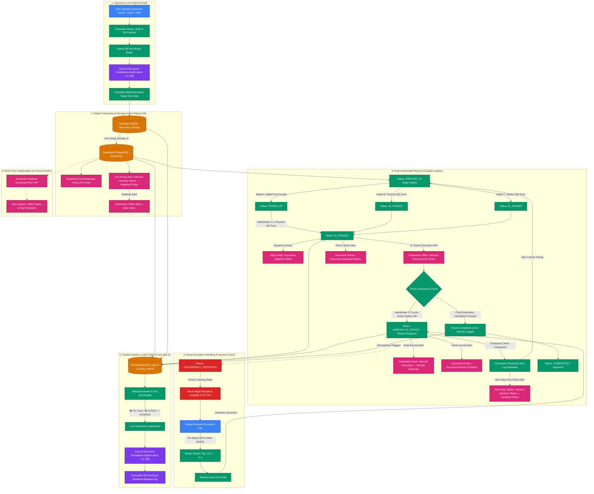

# FlowVision: End-to-End System Process Flow

This document details the complete end-to-end lifecycle of physical and digital documents within the **FlowVision** ecosystem—from initial registration and pre-flight AI audits to dual-handshake QR logistics routing, multi-stage Advance Shipping Notice (ASN) proactive alerts, direct document owner updates, exception handling, immutable compliance auditing, and AI-powered executive analytics.

---

## 1. End-to-End Process Flow Diagram

---

## 2. Step-by-Step Architectural Breakdown

### Phase 1: Ingestion, QR Stamping & Pre-Flight AI Structural Audit
1. **Document Upload**:
   - An authorized user (`client`, `employee`, or `employee_sub_user`) uploads a document (`.docx`, `.xlsx`, `.pdf`) through the upload portal (`POST /api/documents/upload`) or registers metadata-only hard copies (`POST /api/documents/register`).
2. **Deterministic Identifier & QR Generation**:
   - A cryptographically unique UUID is assigned, and a standard tracking QR payload is constructed:
     `flowvision://track/docId-<uuid>`
3. **Physical-Digital Binding (QR Stamping)**:
   - For Word documents (`.docx`) and Excel spreadsheets (`.xlsx`), the tracking QR code is embedded directly into the open XML document archive using `stampDocumentQr.ts`.
4. **Pre-Flight AI Structural Audit**:
   - Raw extracted document text is analyzed via Groq AI (`llama-3.3-70b-versatile` / `openai/gpt-oss-120b`), checking for missing signatures, missing dates, structural omissions, and returning semantic titles and 2-sentence summaries.
5. **Weekend-Aware SLA Target Calculation**:
   - The document's target completion date is calculated from category and stage SLA thresholds, strictly excluding weekend days (Saturdays and Sundays).
6. **Messenger Pool Pickup Broadcast**:
   - Upon document creation, an org-wide pool notification (`target_role: messenger`, `user_id: null`) is broadcast to alert all active couriers that a new document is waiting at the origin desk.
7. **Proactive Pre-Pickup Advance Shipping Notice (ASN)**:
   - The system automatically resolves the Step 1 destination office (`destinationOfficeId`) from `stage_steps` and triggers:
     - `broadcastInboundOfficeNotification`: Persists an **"Inbound Advance Notice — Awaiting Pickup"** notification (`type: 'ASN_PENDING_PICKUP'`) in the destination office desk queue.
     - Realtime WebSocket broadcast `ASN_PENDING_PICKUP` over `org:<org_id>:office:<destinationOfficeId>`.

---

### Phase 2: Hybrid Transactional Storage Persistence
FlowVision uses a **hybrid multi-tier storage architecture**:
1. **Hostinger MySQL (`document_storage`)**:
   - Stores encrypted binary file BLOBs, original filenames, MIME types, and pre-flight AI audit metadata.
2. **Supabase PostgreSQL (`documents`)**:
   - Manages relational state, organization isolation (`org_id`), category links, workflow stage cursors, SLA deadlines, and back-linked `mysql_storage_id` pointers.
3. **Failure-Safe Guarantee**:
   - Binary storage allocation in MySQL is executed first; if MySQL storage write fails, the entire transaction is rolled back with zero phantom document records created.

---

### Phase 3: Dual-Handshake Physical & Digital Logistics & Multi-Party Notifications
The physical movement of documents across government offices is governed by a **deterministic state machine**:

$$\text{CREATED} \longrightarrow \text{PICKED\_UP} \longrightarrow \text{IN\_TRANSIT} \longrightarrow \text{ARRIVED\_AT\_OFFICE} \longrightarrow \text{COMPLETED}$$

#### 1. Three Modalities for Handshake 1 (Courier Pickup):
- **A. Digital Pool Acceptance (`POST /api/notifications/accept-pickup`)**:
  - Courier claims the open pool notification in the Messenger Notifications UI.
  - The system applies an optimistic concurrency lock (`is_claimed = true`, `claimed_by_user_id = messengerId`), transitions tracking status to `PICKED_UP`, assigns `assigned_messenger_id`, and resolves destination office routes.
- **B. Physical QR Handshake Scan (`POST /api/tracking/pickup`)**:
  - **Single Document Scan**: Courier scans the physical document's stamped QR code.
  - **Batch Manifest Checkout**: Courier scans a batch manifest (`document_ids: []`) to check out multiple packages simultaneously.
  - Validates document state and transitions status to `IN_TRANSIT`, sets `current_step = nextStep`, and claims any open messenger pool alerts.
- **C. Station Checkpoint Scan (`POST /api/tracking/checkpoint-pickup`)**:
  - Courier scans an origin dispatch checkpoint QR (`flowvision://track/checkpoint?office_id=…`) to pick up the next waiting `CREATED` package at that station.

#### 2. Tri-Party Notifications on Pickup Transition:
When a courier acquires physical custody:
1. **Origin Office (Departure Notice)**:
   - **Database**: Inserts **"Document Departed Office"** (`target_role: employee`, `office_id: originOfficeId`).
   - **Realtime**: Emits `OUTGOING_DISPATCH` to `org:<org_id>:office:<originOfficeId>`.
2. **Destination Office (In-Transit Transition ASN)**:
   - **Database**: Inserts **"Inbound Document En Route"** (`type: 'ASN_EN_ROUTE'`, `target_role: employee`, `office_id: destinationOfficeId`), specifying that the liaison has picked up the document and is currently in transit to their station.
   - **Realtime**: Emits `INCOMING_DISPATCH` and `ASN_PROACTIVE_ALERT` to `org:<org_id>:office:<destinationOfficeId>` and `org:<org_id>:logistics`.
3. **Document Owner / Uploader (`doc.user_id`)**:
   - **Database**: Inserts direct client update **"Document Departed [Origin Office]"** (`target_role: client`, `user_id: doc.user_id`).
   - **Realtime**: Emits `DOCUMENT_OWNER_UPDATE` to `org:<org_id>:user:<doc.user_id>`.

#### 3. Handshake 2 – Checkpoint Arrival (`POST /api/tracking/dropoff`):
- Courier scans the office wall QR code upon arrival at the destination station.
- Validates office matching (`ROUTE_MISMATCH` protection).
- Transitions tracking status to `ARRIVED_AT_OFFICE`, sets `current_office_id = destinationOfficeId`.
- **Destination Office Alert**: Inserts **"Inbound Document — Review Required"** instructing employees to verify the physical copy.
- **Document Owner Alert**: Inserts **"Document Arrived at [Destination Office]"** and broadcasts `DOCUMENT_OWNER_UPDATE`.

#### 4. Intermediate Station Checkpoint Clearance (`POST /api/documents/complete-checkpoint` & `/api/tracking/checkpoint-done`):
- Employees review physical documents at the station desk and mark the checkpoint done.
- Marks `checkpoint_cleared_step = current_step`.
- Broadcasts pickup pool alert to couriers for the next leg.
- **Proactive Next-Leg Pre-Pickup ASN**: Resolves `current_step + 1` destination office and immediately issues **"Inbound Advance Notice — Awaiting Pickup"** (`type: 'ASN_PENDING_PICKUP'`) to the upcoming station desk.

#### 5. Final Checkpoint Auto-Completion:
- When the document reaches the final route stop (`current_step == maxStepNumber`), the system transitions status to `COMPLETED` and `status = 'Approved'`, calculates weekend-aware SLA actuals, and notifies the document owner.

---

### Phase 4: Smart Exception Handling & Version Control
When physical defects or compliance issues are identified during desk review:
1. **Discrepancy Reporting (`POST /api/documents/issues/create`)**:
   - An employee flags an issue (e.g., *"Missing Signature on Page 3"*).
   - Document tracking status is immediately frozen to `DISCREPANCY_REPORTED`.
   - Appends a critical alert to `document_tracking_events` and broadcasts across org Realtime channels.
2. **Physical Freezing Enforcement**:
   - Handshake endpoints (`pickup.post.ts`, `dropoff.post.ts`, `advance.post.ts`, `checkpoint-pickup.post.ts`) reject any physical movement attempts on frozen documents with `HTTP 422 (DISCREPANCY_REPORTED)`.
3. **Transactional Document Revision (`POST /api/documents/:id/revise`)**:
   - A revised file is uploaded to rectify the discrepancy.
   - The system re-stamps the tracking QR code onto the new buffer, persists the new BLOB in MySQL, increments the document version tag (`v1.0` $\rightarrow$ `v1.1`), and logs the modifier history in `activity_logs`.
4. **Issue Resolution & Unfreezing (`POST /api/documents/issues/resolve`)**:
   - Once resolved, the issue status transitions to `RESOLVED`, the document tracking status is restored to `ARRIVED_AT_OFFICE`, and clean delivery routing resumes.

---

### Phase 5: Immutable Compliance Audit Trails & Non-Scan Logging
FlowVision maintains a **dual-ledger audit architecture**:
1. **Logistics Timeline (`document_tracking_events`)**:
   - Immutable historical record of every physical scan, checkpoint clearance, discrepancy alert, and route completion.
2. **Comprehensive Activity & Compliance Ledger (`activity_logs`)**:
   - Captures all physical and non-scan interactions across the organization, including:
     - `upload`: Initial document registration.
     - `scan`, `pickup`, `dropoff`: Physical custody handoffs.
     - `view`: Document metadata lookups via `/api/documents/:id/detail`.
     - `download`: Binary file streaming via `/api/documents/:id/blob`.
     - `document_revision`: Version bumping and replacement file updates.
     - `issue_report`, `issue_resolve`: Exception lifecycle events.
     - `checkpoint_scan`: Station check-in scans.

---

### Phase 6: Global Analytics, 3-Tier SLA & Groq AI Executive Digest
1. **Weekend-Aware 3-Tier SLA Classification (`portalAnalytics.ts`)**:
   - Evaluates elapsed business hours against stage SLA limits (skipping Saturday and Sunday UTC):
     - 🟢 **On Track**: $\text{Business Hours Elapsed} < 70\% \times \text{SLA Limit}$
     - 🟡 **At Risk**: $70\% \times \text{SLA Limit} \le \text{Business Hours Elapsed} \le 100\% \times \text{SLA Limit}$
     - 🔴 **Breached**: $\text{Business Hours Elapsed} > \text{SLA Limit}$
2. **Station Congestion & Bottleneck Detection**:
   - Calculates desk dwell time ratios against historical averages ($> 1.5\times$ indicates high congestion risk).
3. **Groq AI Executive Operations Digest (`POST /api/client/dashboard-ai`)**:
   - Standardized high-performance LLM engines (`llama-3.3-70b-versatile`, `openai/gpt-oss-120b`, `qwen/qwen3.8-27b`) synthesize live operational snapshots into plain-English supervisory briefs with actionable re-routing and workload rebalancing directives.

---

### Phase 7: Real-Time Collaboration & Scoped Notifications
- **Org-Isolated Realtime Broadcasts**:
  - Logistics stream: `org:<org_id>:logistics`
  - Office desk queue & ASN alerts: `org:<org_id>:office:<office_id>`
  - Document owner update channel: `org:<org_id>:user:<user_id>`
  - Issue collaboration thread: `org:<org_id>:issue:<issue_id>`
- **Scoped Employee Notifications**:
  - Resolves all office assignments for each employee (`users.office_id`, `users.current_office_id`, and `offices.assigned_user`) ensuring destination office employees receive immediate notifications for inbound documents.
- **SSR-Safe Realtime Architecture**:
  - Server endpoints emit realtime events through Supabase Realtime REST API without creating NodeJS WebSocket instances; browser clients subscribe safely in `onMounted()` / `process.client`.

---

## 3. State Machine Transition Summary

| Current Status | Permitted Next Status | Triggering Action / Endpoint | Notifications Generated |
| :--- | :--- | :--- | :--- |
| `CREATED` | `CREATED` (Pre-Pickup ASN) | `POST /api/documents/upload` or `register` | Destination Office: *"Inbound Advance Notice — Awaiting Pickup"* (`ASN_PENDING_PICKUP`). Messenger Pool: *"New Document Ready for Pickup"*. |
| `CREATED` | `PICKED_UP` | `POST /api/notifications/accept-pickup` | Destination Office: *"Inbound Document En Route"*. Document Owner: *"Document Departed Office"*. |
| `CREATED` | `IN_TRANSIT` | `POST /api/tracking/pickup` or `checkpoint-pickup` | Origin Office: *"Document Departed Office"*. Destination Office: *"Inbound Document En Route"*. Document Owner: *"Document Departed Office"*. |
| `PICKED_UP` | `IN_TRANSIT` | `POST /api/tracking/pickup` | Courier confirms physical QR scan; status advances to `IN_TRANSIT`. |
| `IN_TRANSIT` | `ARRIVED_AT_OFFICE` | `POST /api/tracking/dropoff` | Destination Office: *"Inbound Document — Review Required"*. Document Owner: *"Document Arrived at [Office]"*. |
| `ARRIVED_AT_OFFICE` | `ARRIVED_AT_OFFICE` (Cleared) | `POST /api/documents/complete-checkpoint` | Next Destination Station: *"Inbound Advance Notice — Awaiting Pickup"*. Messenger Pool: *"New Document Ready for Pickup"*. |
| `ARRIVED_AT_OFFICE` | `PICKED_UP` | `POST /api/notifications/accept-pickup` | Next courier claims pickup after checkpoint desk review. |
| `ARRIVED_AT_OFFICE` | `IN_TRANSIT` | `POST /api/tracking/pickup` | Next courier scans document QR directly to advance along route. |
| `ARRIVED_AT_OFFICE` | `COMPLETED` | `complete-checkpoint.post.ts` (Final Stop) | Final route stop reached; Document Owner: *"Document Update: COMPLETED"*. |
| `ARRIVED_AT_OFFICE` | `DISCREPANCY_REPORTED` | `POST /api/documents/issues/create` | Physical/quality issue flagged; document tracking frozen. |
| `DISCREPANCY_REPORTED` | `ARRIVED_AT_OFFICE` | `POST /api/documents/issues/resolve` | Issue resolved (optionally revised); tracking resumed. |
| `COMPLETED` | *None* | Final State | Terminal state; archived and certificate issued. |

---

## 4. Security & Organization Isolation Framework

- **Tenant Isolation (`SECURITY_ORG_MISMATCH`)**: All database queries, blob access, and tracking updates strictly validate `org_id` derived from the server session cookie. Cross-tenant access is rejected with `HTTP 403 Forbidden`.
- **Role-Based Access Control (RBAC)**:
  - **`client` / `admin` / `auditor`**: Full organizational oversight, global analytics, compliance logs, personal document notifications, and AI executive digests.
  - **`employee` / `employee_sub_user`**: Office desk queue management, checkpoint clearance, document registration, discrepancy management, inbound transfer review, and live previews.
  - **`messenger`**: QR scanning (single/batch pickups, office dropoffs), delivery manifest management, pickup claiming, and transit status updates.
- **Fail-Safe Blob Access**: Binary streaming (`/api/documents/:id/blob`) uses dual ID-and-UUID lookups, ensuring zero broken file links while strictly maintaining tenant boundaries.
