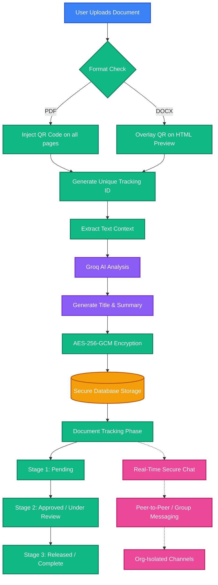

# FlowVision: End-to-End Process Flow

This document outlines the complete lifecycle of a document within the FlowVision ecosystem, from initial upload to final collaboration and storage.

## Process Flow Diagram

## Step-by-Step Breakdown

### 1. Document Ingestion
The process begins when a user drags and drops a file (PDF or Word DOCX) into the FlowVision frontend upload portal.

### 2. HashID & Visual Injection
The system instantly generates a secure, unique tracking ID (e.g., `FLOW-XXXXX`). 
- For PDFs, a tracking QR code is embedded directly onto the pages. 
- For Word documents, it is rendered as an overlay for previews and printing.

### 3. AI-Powered Extraction
FlowVision extracts the raw text from the document and securely passes it to the integrated **Groq (Llama 3.3)** AI engine. In sub-seconds, the AI processes the context and returns a concise, accurate Title and Summary.

### 4. Secure Storage
Before the file ever touches the database, it is passed through a Nitro backend plugin where the binary buffer is encrypted using military-grade **AES-256-GCM** encryption. The encrypted data, along with the AI metadata, is safely persisted.

### 5. Tracking & State Machine
The document enters the tracking pipeline. Authorized personnel can update its state (e.g., Pending → Approved → Released). The embedded QR code allows physical documents to be scanned back into the system to instantly update their digital status.

### 6. Real-Time Collaboration
Running parallel to the tracking phase, users can open secure communication channels directly tied to the document. Using the stateless Socket.io integration, teams can discuss the document via direct messages or group chats, all strictly isolated by their organization ID (`org_id`).
