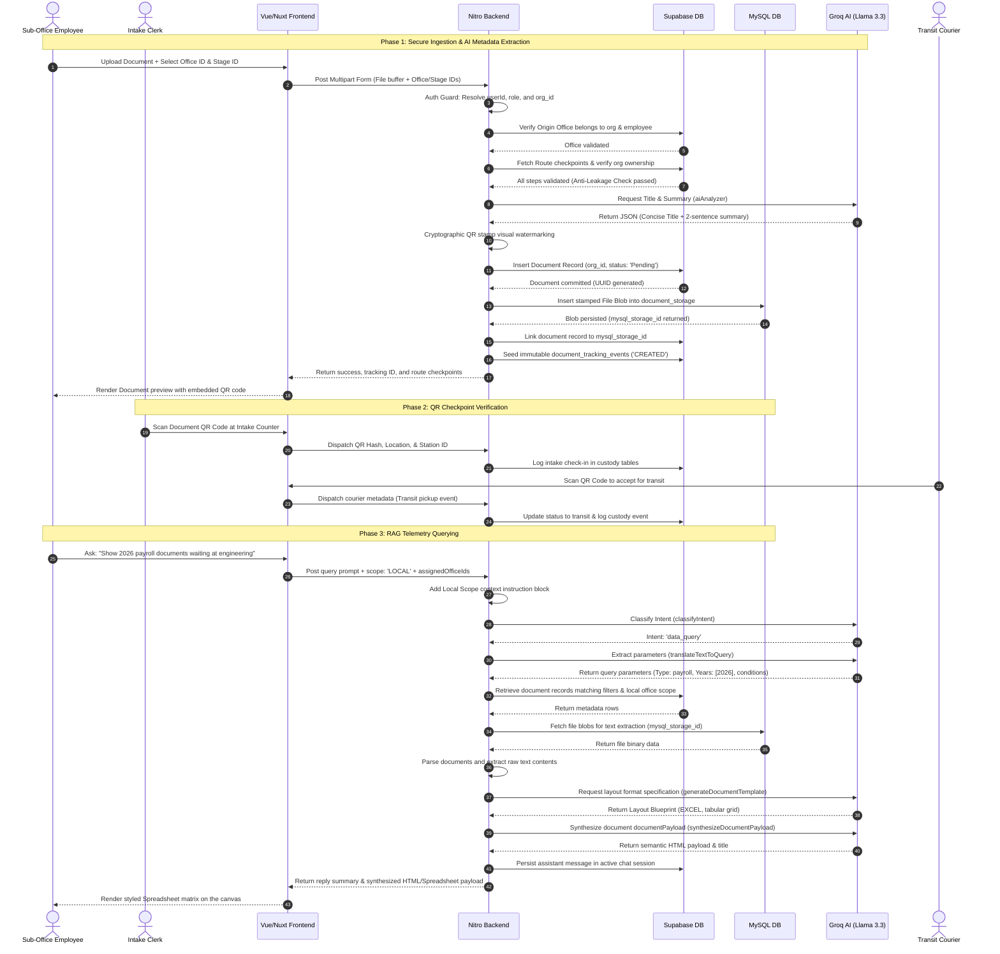

# 🌊 FlowVision: Core Architectural Features, AI RAG Pipeline & Process Flow

This document provides a highly accurate, technical deep-dive into the core architectural components, the multi-tiered Generative AI RAG pipeline, and the end-to-end processing workflows of **FlowVision**.

---

## 🏗️ I. Architectural Foundations & Storage Design

FlowVision is engineered as a robust, hybrid full-stack application built on **Nuxt 4**, **Nitro Server Engine**, **Supabase**, and **MySQL**. It utilizes a dual-database design to achieve secure, low-latency document routing and metadata analysis.

```
                      ┌───────────────────────────────────────┐
                      │          FLOWVISION ARCHITECTURE      │
                      └───────────────────┬───────────────────┘
                                          │
         ┌───────────────────┬────────────┴────────────┬───────────────────┐
         ▼                   ▼                         ▼                   ▼
┌─────────────────┐ ┌─────────────────┐       ┌─────────────────┐ ┌─────────────────┐
│  Dual-Storage   │ │   Multi-Scope   │       │ Route Checkpoint│ │  Cryptographic  │
│  Hybrid Engine  │ │ Ingestion (API) │       │   Anti-Leakage  │ │   QR Stamping   │
└─────────────────┘ └─────────────────┘       └─────────────────┘ └─────────────────┘
```

### 1.1. Dual-Storage Engine Strategy
To balance relational metadata integrity and heavy binary file storage, FlowVision partitions data storage between two engines:
1. **Supabase (PostgreSQL):** Holds core relational models, active user sessions, organization profiles (`org_id`), and tracking metadata (titles, status logs, office parameters).
2. **Hostinger MySQL Database (`document_storage`):** Offloads the storage of raw binary documents (PDF/DOCX/XLSX) as encrypted `file_blob` structures, referenced in Supabase via `mysql_storage_id` to prevent DB size bloat and preserve query performance.

### 1.2. Multi-Scope Ingestion Pipeline (`/api/documents/upload.post.ts`)
The upload pipeline validates role-specific context securely on the server-side, enforcing two distinct operational paths:
* **Client Administrator Scope:** `origin_office_id` is set to `NULL`. Documents are registered organization-wide, ready for custom routing paths.
* **Sub-Office Employee Scope:** Requires a valid `origin_office_id`. The server validates that the sub-office exists, belongs to the employee's resolved `org_id`, and that the employee is the `assigned_user` for that office. The asset is then registered as physically present and "armed for courier pickup" at that office checkpoint.

### 1.3. Route Checkpoint Anti-Leakage Protection
When a document is uploaded with a specific stage routing template (`stage_id`), the server performs a **Route Checkpoint Anti-Leakage Check**:
* It retrieves all ordered sequence steps (`stage_steps`) for the route.
* It verifies that the `org_id` of *every single destination office* matches the uploader's server-resolved `org_id`.
* If a single cross-tenant office pointer is detected, the transaction immediately aborts with a `403 Forbidden` error. This prevents actors from injecting external offices to leak document metadata.

### 1.4. Document QR Code Stamping & Watermarking
* Upon upload, a unique cryptographic ID is generated via `hashids` (`flowvision://track/document_uuid`).
* Before storage, the server uses `pdf-lib`, `docx-preview`, or templating libraries to dynamically stamp/watermark the tracking QR code onto document pages.
* If file watermarking fails, the transaction is rolled back, deleting any partially written Supabase records to ensure transaction integrity.

---

## 🤖 II. Deep-Dive: FlowVision AI & RAG Engine

FlowVision implements a sophisticated, multi-stage RAG (Retrieval-Augmented Generation) pipeline that powers metadata extraction, intent routing, conversational queries, and automated document synthesis.

```mermaid
flowchart TD
    %% Define Styles
    classDef client fill:#0f172a,stroke:#38bdf8,stroke-width:2px,color:#fff;
    classDef route fill:#1e293b,stroke:#a855f7,stroke-width:2px,color:#fff;
    classDef db fill:#0f172a,stroke:#eab308,stroke-width:2px,color:#fff;
    classDef ai fill:#0f172a,stroke:#f43f5e,stroke-width:2px,color:#fff;

    User[User Input / Prompt] :::client --> Scope[Add Scope Context Block<br>GLOBAL | LOCAL | PERSONAL] :::route
    Scope --> Intent{Intent Router<br>classifyIntent} :::route

    Intent -->|conversation| Conversational[Conversational Memory Engine<br>generateConversationalReply] :::ai
    Intent -->|document_revision| Revision[Active Document Canvas Revision<br>reviseDocumentPayload] :::ai
    Intent -->|data_query| TTQT[Text-to-Query Translation<br>translateTextToQuery] :::ai

    TTQT --> SQL[Interpret Filters & Format] :::route
    SQL --> Supabase[Fetch Supabase Document Records] :::db
    Supabase --> MySQL[Hydrate File Text via MySQL Storage] :::db
    MySQL --> Formatter[Gen AI Template Formatter<br>generateDocumentTemplate] :::ai
    Formatter --> Synthesizer[Document Synthesizer<br>synthesizeDocumentPayload] :::ai

    Conversational --> Reply[Chat Box Reply] :::client
    Revision --> Canvas[Redrawn Canvas / Spreadsheet Matrix] :::client
    Synthesizer --> Canvas :::client
```

### 2.1. Groq Ingestion Analyzer (`server/utils/aiAnalyzer.ts`)
* Implements a lazy-loaded Groq client (`useGroq()`) to prevent cold-start crashes in serverless instances.
* Extracts document text via `documentParser` and queries the Groq SDK (`llama-3.3-70b-versatile`).
* Forces the LLM to output a strict JSON object mapping containing a concise `title` and a precise, **two-sentence summary** for the `description` field.

### 2.2. Multi-Turn RAG Query Endpoint (`server/api/rag/query.ts`)
The RAG gateway coordinates the chat session and handles user queries using a sequence of specialized AI workers:

#### 1. Scope Context Block Injection
Before sending a query to the LLM, the API prepends a secure, server-derived **Scope Context Block** based on the employee's dashboard toggle:
* **`ORGANIZATION-GLOBAL` Scope:** Spans all records in the organization (`org_id`). Informs the model to generate macro-level summaries, aggregations, and comparisons.
* **`OFFICE-LOCAL` Scope:** Limits the model's analytical context strictly to records registered under or currently residing inside the user's assigned offices.
* **`EMPLOYEE-PERSONAL` Scope:** Restricts lookup strictly to documents uploaded by the authenticated employee.

#### 2. Intent Classification Router (`server/utils/intentRouter.ts`)
Determines the user's intent from the scope-enriched prompt and the last four turns of conversation history:
* **`conversation`:** Greetings, general capability questions, or requests to explain a previous answer.
* **`document_revision`:** Formatting updates, style changes, or layout adjustments (e.g. converting to an Excel spreadsheet grid) targeted at the active canvas document.
* **`data_query`:** Requests to fetch, count, filter, or summarize document lists.

#### 3. Text-to-Query Translation (TTQT) (`server/utils/ttqt.ts`)
For `data_query` actions, TTQT analyzes the request and produces a structured JSON output:
* Identifies the `documentType` category.
* Extracts year arrays and filters.
* Generates a `mockSqlWhereClause` to guide the backend data filtering.

#### 4. Semantic Lookup & MySQL Context Hydration
* The system queries Supabase using keyword arrays derived from the TTQT output, filtered by `org_id` and the user's active office scope.
* The system retrieves the top matching records and hydrates their content. It fetches the binary blobs from the MySQL `document_storage` table, extracts their raw text on-the-fly, and attaches it as LLM context (`actualFileTextContent`).

#### 5. Gen AI Layout Formatter (`server/utils/formatter.ts`)
* Acts as a layout architect. It analyzes the user prompt and hydrated rows to define a structured JSON layout blueprint (`targetFileFormat`, `visualLayoutSpecification`, `dataBuilderDirectives`).
* It determines whether the payload should render as a Tabular Grid (Excel mode) or an Executive Text Document (Word mode).

#### 6. Document Synthesizer & Canvas Revision (`server/utils/documentSynthesizer.ts`)
* Fuses the layout blueprint and the database rows to build semantic, client-renderable HTML content.
* Supports **Interactive Layout Switching**: When the user requests a spreadsheet layout (e.g., *"convert to excel"*), the synthesizer triggers `reviseToSpreadsheetMatrix`. This strips all executive narratives, signature blocks, and descriptive text to output a clean, Tailwind-styled spreadsheet grid container (`fv-spreadsheet-matrix`).

#### 7. Conversational memory handler (`server/utils/conversation.ts`)
* Handles general chat questions. It uses the last 5 turns of conversation memory to keep answers coherent, professional, and context-aware.

---

## 🔌 III. Real-Time Sync & Chat Protocol

FlowVision features organization-isolated, live coordination tools for office clerks and administrators:

### 3.1. Zero-Dependency Phoenix WebSocket Client (`useSupabaseClient.ts`)
Instead of importing heavy client libraries, FlowVision features a native WebSocket wrapper `RealtimeSocket` to communicate with the **Supabase Realtime Channel** (using the Phoenix Broadcast protocol):
* Keeps connections alive via automatic hearbeat signals sent every 25 seconds.
* Allows pages to subscribe to specific document channel topics.
* Receives broadcast events to trigger live, low-latency chat updates on the client canvas.

### 3.2. Org-Secured Chat Retrieval API (`/api/chats/[org_id].get.ts`)
To fetch conversation histories safely, the endpoint enforces a strict organizational boundary:
* **Parity Check:** It retrieves the document record from MySQL and verifies that the document's `office_id` matches the `org_id` route parameter.
* **Failure Condition:** If the IDs do not match, it logs a security warning and returns a `403 Forbidden` error to block cross-tenant database reads.
* **Output:** Returns a strongly-typed `IChatResponse[]` containing chronological messages mapped directly to the `chats` schema.

---

## 🔄 IV. System Process Flow

### 4.1. End-to-End Sequence Diagram



### 4.2. Detailed Process Steps

#### Step 1: Upload & RBAC Authentication
The employee uploads a document, providing their assigned `origin_office_id` and a routing template ID. The server validates the session cookies, resolves the actor's profile from the database, and derives the `org_id` securely.

#### Step 2: Anti-Leakage & Path Verification
If a route template is supplied, the server parses the sequential steps. It cross-checks the organizational ownership (`org_id`) of every referenced office node to ensure no cross-tenant checkpoints are injected.

#### Step 3: Ingestion AI Analysis
The server parses the document text and invokes Groq (Llama 3.3 70B) using a strict system instruction to extract the title and write a concise, two-sentence summary.

#### Step 4: Visual QR Stamping & Database Write
A unique tracking ID is generated. The server stamps the tracking QR code onto the file pages. The metadata is stored in Supabase, the stamped file blob is stored in MySQL, and the records are linked via `mysql_storage_id`.

#### Step 5: Initial Tracking Ledger Seed
The server seeds the immutable `document_tracking_events` table with a `CREATED` status. This writes the actor profile, notes, and a serialized snapshot of the locked routing pathway to preserve the audit trail.

#### Step 6: Physical QR Routing Scans
As the courier moves the document, handlers scan the QR code at checkpoints (Intake, Transit, Handoff, Final Drop-off). Scans write geolocation data, timestamps, handler IDs, and QR hashes to the custody tables.

#### Step 7: Stateful RAG Querying & Routing
Users ask questions about documents in the RAG console. The Intent Router processes the query. If it is a data query, it translates the text using the TTQT worker, retrieves records, reads binary files from MySQL, and formats the output using the layout template and document synthesizer.

#### Step 8: Client Canvas Sync & Spreadsheet Revisions
The frontend receives the HTML document payload and displays it on the interactive side-canvas. If the user requests layout changes (e.g. converting a report to a spreadsheet), the backend revises the active payload in-memory without hitting the database, refreshing the canvas instantly.
